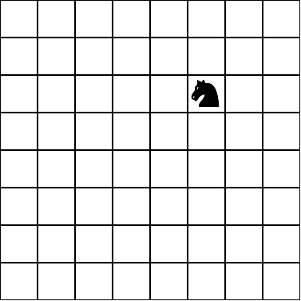

# Racket-Knight-Tour

Programa hecho en Racket que muestra soluciones del [Problema del caballo](https://es.wikipedia.org/wiki/Problema_del_caballo)

El recorrido a seguir se calcula utilizando un programa en C++, el cual utiliza el [Algoritmo de Warnsdorff](https://www.geeksforgeeks.org/warnsdorffs-algorithm-knights-tour-problem/).
Los datos generados por dicho programa luego son usados por Racket para graficar una solución del problema.

Acepta tableros desde 5x5 hasta 30x30